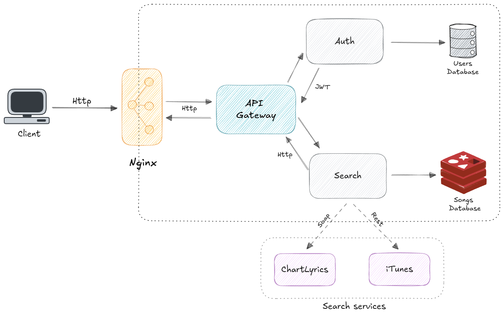
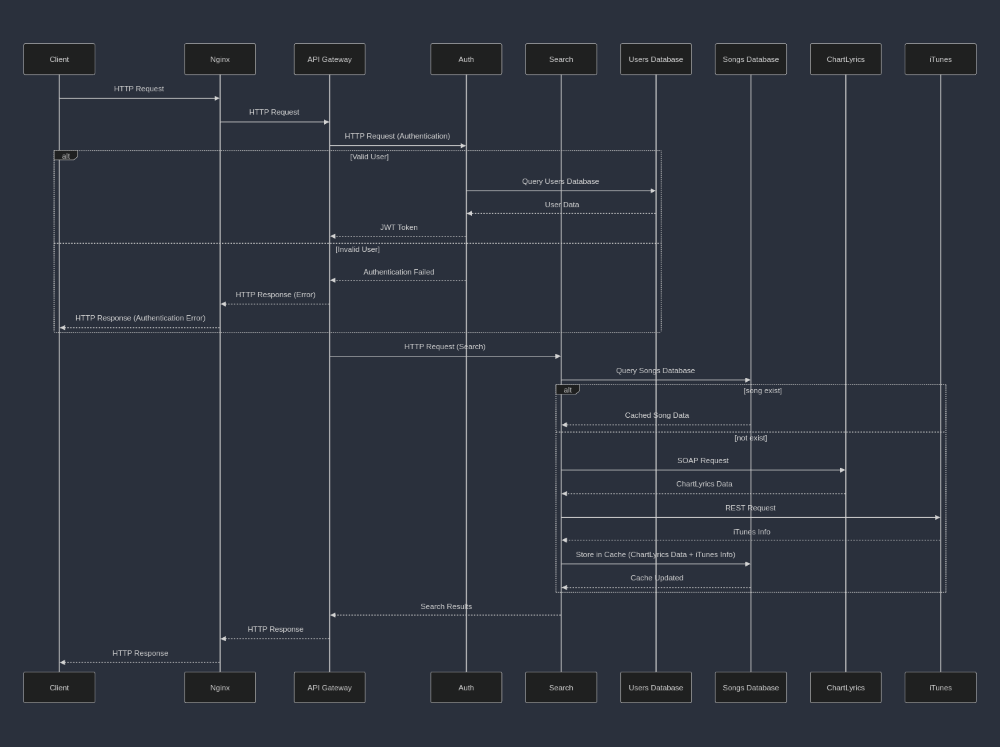
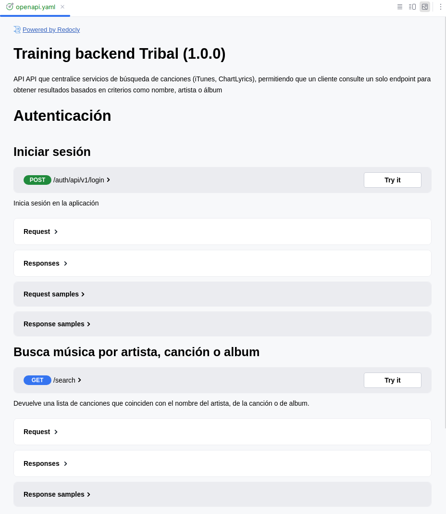

# Training Back-end

> 💡 Consiste en crear una API que centralice servicios de búsqueda de canciones (iTunes, ChartLyrics),
> permitiendo que un cliente consulte un solo endpoint para obtener resultados basados en criterios como nombre, artista o álbum.

## ⚙️ Diagrama de Solución



Esta arquitectura se basa en el diseño de sistemas distribuidos, donde los componentes centrales son independientes de la infraestructura, 
permitiendo una mayor flexibilidad y facilidad para realizar cambios en las partes externas sin afectar la lógica del negocio.

La aplicación incluye un servicio `Nginx` que actua como servidor proxy que recibe todas las solicitudes del cliente, 
`API Gateway` que maneja la autenticación y centraliza solicitudes a servicios especializados como `Auth` para la autenticación con JWT y`Search` para la busqueda de canciones.
El servicio `Users Database` Es la base de datos que almacena la información de los usuarios, como credenciales, roles.
`Songs Database` Actúa como una caché que almacena los resultados de las búsquedas de canciones para mejorar el rendimiento en futuras consultas 
y por ultimo `iTunes` y `ChartLyrics` son servicios externos que se utilizan para obtener información de las canciones.

## 🎲 Diagrama de Secuencia



## 📚 Lista de operaciones

| Metodo | Path                 | Descripcion                                           | Destino |
|:-------|----------------------|-------------------------------------------------------|---------|
| POST   | auth/api/v1/login    | Inicio de sesion de usuario                           | auth    |
| POST   | auth/api/v1/register | Registra un nuevo usuario                             | auth    |
| GET    | /search              | Permite buscar canciones por nombre, artista o álbum. | search  |

## 📦  Estructura de los microservicios

La arquitectura usada en los servicios es hexagonal, también conocida como "Arquitectura de Puertos y Adaptadores", se organiza en torno a una estructura central (núcleo) rodeada por adaptadores que se comunican con el mundo exterior. 
En este proyecto, se identifican las siguientes capas:

1. **model**: Contiene las definiciones de las estructuras de datos y entidades como `error.go`, `router.go`, etc
2. **domain**: Contiene la lógica de negocio agrupada en casos de uso e intefaces(para la inversión de de pendencias), en carpetas como `search` .
3. **infrastructure**: Maneja la interacción con servicios externos, bases de datos, llamada a otros servicios  y otros sistemas.
    - handler: Actúan como interfaces de entrada que reciben las solicitudes y responden a los clientes, se usa fiber.
4. **bootstrap**: Contiene scripts o archivos que configuran y preparan el entorno del proyecto.
5. .**tribal**: Contiene la documentación en **Open API** del endpoint principal del servicio

En el codigo de esta arquitectura se aplican buenas practicas como los principios SOLID, etc.

```
.
└── my-app
    ├── .tribal
    │   ├── openapi.go
    ├── bootstrap
    │   ├── bootstrap.go
    │   ├── env.go
    │   ├── fiber.go
    │   ├── logger.go
    ├── domain
    │   ├── search
    │   │   ├── search
    │   │   ├── usecase
    ├── infrastructure
    │   ├── handler
    │   │   ├── search
    │   │   │   ├── handler.go
    │   │   │   ├── router.go
    │   │   ├── response
    │   │   │   ├── message.go
    │   │   │   └── response.go
    │   │   └── router.go
    │   └── redis
    ├── model
    │   ├── error.go
    │   ├── logger.go
    │   ├── model.go
    │   ├── model_test.go
    │   └── router.go
    ├── Dockerfile
    ├── docker-compose.yaml   
    ├── go.mod
    ├── .env.example    
    └── main.go  
```
---

## 💻 Installation

1. **Instalación de herramientas Básicas**
- [Git](https://git-scm.com/book/en/v2/Getting-Started-Installing-Git)
- [Docker](https://docs.docker.com/get-docker/)
- [Docker Compose](https://docs.docker.com/compose/install/)

2. **Clonación de repositorios de los servicios**
   ```bash
   git clone https://github.com/MikelSot/tribal-training-back.git
   git clone https://github.com/MikelSot/tribal-training-auth.git
   git clone https://github.com/MikelSot/tribal-training-search.git
   ```

3. **Configuración de variables de entorno**
   
   En cada carpeta de los servicios se encuentra un archivo `.env.example` que contiene las variables de entorno necesarias para el correcto funcionamiento de los servicios, 
     se debe copiar este archivo y renombrarlo a `.env` y configurar las variables de entorno necesarias.

## 🚀 Deployment

Se uso docker compose para gestionar los contenedores(Dockerfile) de cada aplicación o servicio, se usaron redes para la comunicación entre contenedores y volúmenes para la persistencia de la data en conjunto con la base de datos.

Para levantar los servicios se debe ejecutar el siguiente comando en la raiz del proyecto:

```bash
  docker-compose up -d
```

Este comando hará lo siguiente:

- Construirá las imágenes Docker para los servicios de autenticación, búsqueda y el API Gateway.
- Levantará los contenedores de PostgreSQL, Redis, autenticación, búsqueda y el API Gateway.
- Creará una red de Docker para la comunicación entre los contenedores.
- Creará volúmenes de Docker para la persistencia de la data en PostgreSQL y Redis.
- Expondrá los puertos necesarios para acceder a los servicios.
- Levantará los servicios en segundo plano.


## 🧙 Endpoints

La documentacion de los endpoints se encuentran en el archivo `.tribal`, en el archivo `openapi.yaml` 
esta documentacion se encuentra escrita en formato **OpenAPI**, para lo cual se requiere que tenga instalado en su 
editor una extension que le permita visualizar este tipo de archivos, en vscode puede instalar la extension `Swagger Viewer`.

En este archivo se encuentran los endpoints de la aplicacion, los metodos que aceptan, los parametros que reciben y los codigos de respuesta.

Acontinuacion se muestra un ejemplo de como se debe visualizar la documentacion de los endpoints.




---

